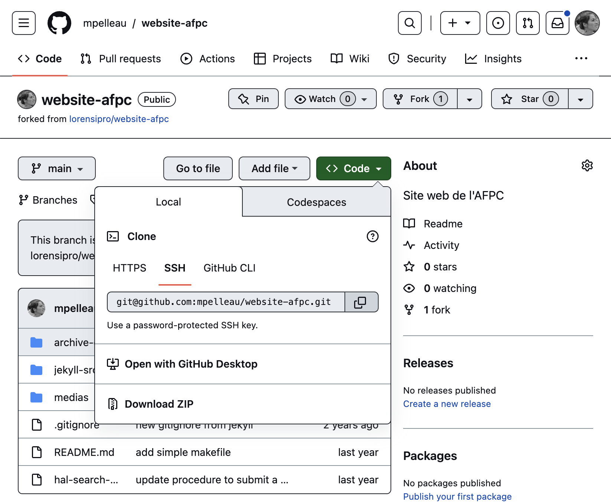
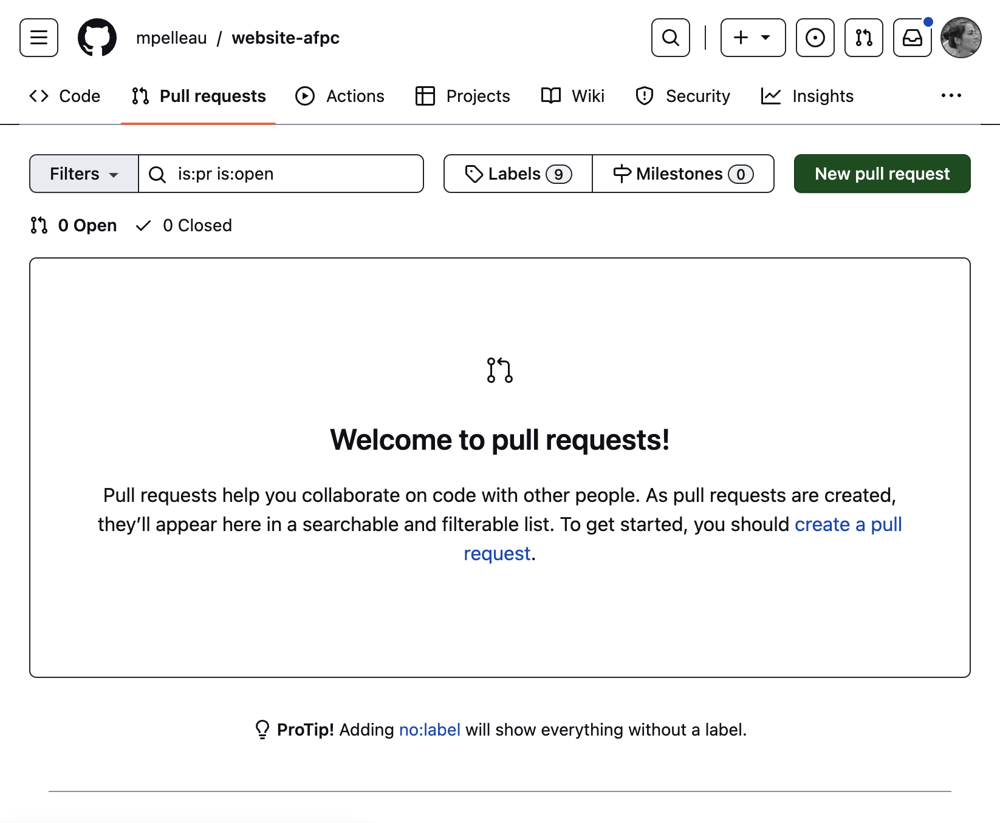

# website-afpc
Site web de l'AFPC : https://www.afpc-asso.org/

# Les sources sont dans jekyll-src

 - Installer ruby : `brew install ruby@2.7`
 - Pour initialiser votre jekyll local : `bundle install`
 - Puis pour servir le jekyll : `bundle exec jekyll serve --config _config.yml,_config_dev.yml`
 - Ou utiliser le Makefile : `make serve`

# Soumission des modifications

Contribuer au site est facile.

Deux options s'offrent à vous, envoyer votre annonce ou offre (au format markdown `.md` de préférence) soit par mail soit directement sur Github.

Vous écrivez une annonce ? Inspirez-vous d'une autre annonce ou du [modèle](https://github.com/lorensipro/website-afpc/blob/main/jekyll-src/_posts/divers/2022-07-21-modeleAnnonce.md).
Vous écrivez une offre ? Inspirez-vous d'une autre offre ou du [modèle](https://github.com/lorensipro/website-afpc/blob/main/jekyll-src/_posts/offres/2022-07-21-modeleOffre.md).  
Vous débutez avec git ? Lisez le guide ci-dessous.

## Soumission par Github

1. Forker le [projet](https://github.com/lorensipro/website-afpc).
2. Travailler avec le code source : le site est basé sur [jekyll](https://jekyllrb.com/), générateur de site statique simple, prêt-à-bloguer.
3. Modifier le site et le tester localement.
4. Envoyer une pull request sur Github.

### Forker le projet

1. Créez un compte sur github
2. Forkez le projet en cliquant sur le bouton en haut à droite de cette page.
  
  
3. Clonez localement (`git clone`) votre fork. Vous trouverez l'adresse de votre fork en cliquant sur le bouton vert.
```
git clone git@github.com:YOUR_USERNAME/website-afpc.git
```
  
4. Configurez votre fork pour pouvoir le synchroniser avec le projet en suivant la [documentation](https://help.github.com/en/github/collaborating-with-issues-and-pull-requests/configuring-a-remote-for-a-fork).
```
git remote add upstream git@github.com:lorensipro/website-afpc.git
```

Il est possible de contribuer sans compte github (en clonant et patchant) si vous êtes déjà familier avec `git`. 

### Travailler sur sa version locale

### Synchroniser ses modifications
C'est le moment le plus délicat. Le risque est de corrompre votre historique.  
Votre copie de travail doit être propre. Utilisez `git stash` pour sauvegarder vos modifications non commitées.

Mettez d'abord à jour à partir du github.
```
 git pull upstream
```

Récupérer vos modifications.
```
git stash pop
```

Il est possible que vous ayez quelques conflits à arbitrer.

Ajouter vos fichiers avec `git add`, créer un commit avec `git commit` et envoyer sur votre dépôt les modifications avec `git push`.

### Soumettre une Pull Request

Cliquez sur le bouton `New Pull Request` dans l'onglet `Pull Request` de votre fork.
  
Configurez la pull request de la manière suivante : 
 - base repository : `lorensipro/website-afpc` 
 - base : `main`
 - head repository : `YOUR_USERNAME/website-afpc`
 - compare : `main`
  
 
Normalement, il ne devrait plus y avoir de conflits.

  

Il ne reste qu'à cliquer sur `Create pull request`.